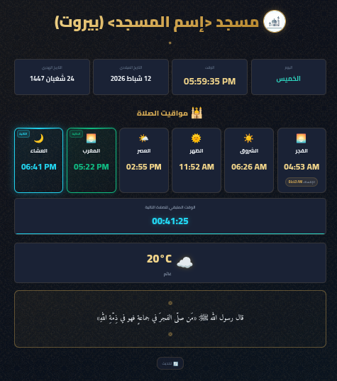

<p align="center">
  
</p>

<h1 align="center">🕌 لوحة بيانات المسجد المجانية</h1>
<h3 align="center">Free Masjid Dashboard</h3>

<p align="center">
  لوحة بيانات إسلامية مفتوحة المصدر لعرض مواقيت الصلاة والإقامة والتاريخ الهجري والطقس.
  <br>
  تعمل كصفحة ويب ثابتة بدون خادم — مثالية للشاشات داخل المساجد أو النشر على GitHub Pages.
</p>

<p align="center">
  
</p>

---

## ✨ المميزات

| الميزة | الوصف |
|--------|-------|
| 🕐 **مواقيت الصلاة** | جلب تلقائي من [Aladhan API](https://aladhan.com/prayer-times-api) مع دعم +23 طريقة حساب |
| ⏳ **العد العكسي للصلاة التالية** | عرض الوقت المتبقي مع تنبيه بصري في آخر 60 ثانية |
| 🔔 **العد العكسي للإقامة** | عد تنازلي يظهر بعد دخول وقت كل صلاة، مع تنبيه بصري وصوتي عند حلول الإقامة |
| 🔊 **أصوات الأذان والإقامة** | تشغيل ملف صوتي عشوائي عند الأذان (مع فصل صوت الفجر) وعند الإقامة — الملفات غير الموجودة تُتجاهل تلقائياً |
| 📅 **التاريخ الهجري والميلادي** | مع دعم 6 أنماط لتسمية الأشهر (شامي، مصري، مغاربي، عراقي، إنجليزي، فرنسي) |
| 🌤️ **حالة الطقس** | جلب تلقائي من [Open-Meteo API](https://open-meteo.com/) — مجاني بدون مفتاح |
| 🌙 **وقت الإمساك** | يُعرض تلقائياً على بطاقة الفجر |
| 📝 **رسالة يومية** | حديث أو آية قرآنية اختيارية |
| 🔄 **إعادة محاولة تلقائية** | عند فشل جلب البيانات، يُعاد المحاولة كل 30 ثانية |
| 📱 **تصميم متجاوب** | يعمل على الشاشات الكبيرة (TV)، الأجهزة اللوحية، والهواتف |
| 🎨 **تصميم إسلامي داكن** | بنقوش هندسية وألوان ذهبية متناسقة |
| 🔇 **تفعيل الصوت التلقائي** | يحاول تشغيل الصوت تلقائياً — في حالة رفض المتصفح يظهر شريط تفعيل لمرة واحدة فقط |

---

## 🚀 التشغيل السريع

### الطريقة 1: فتح مباشر

1. حمّل المشروع أو استنسخه:
   ```bash
   git clone https://github.com/yucefsourani/free-masjid-dashboard.git
   ```
2. عدّل ملف `config.js` بإعدادات مسجدك (الاسم، الإحداثيات، طريقة الحساب...)
3. أضف ملفات الأذان (`.mp3`) إلى مجلد المشروع (اختياري)
4. افتح `index.html` في المتصفح

### الطريقة 2: GitHub Pages

1. انسخ (Fork) المستودع إلى حسابك على GitHub
2. عدّل ملف `config.js` بإعدادات مسجدك
3. أضف ملفات الأذان (`.mp3`) إلى المستودع عبر GitHub (اختياري):
   - اذهب إلى صفحة المستودع → **Add file** → **Upload files**
   - ارفع ملفات `adhan1.mp3`, `fajr-adhan1.mp3`, `iqama1.mp3` إلخ...
4. اذهب إلى **Settings → Pages → Source** واختر **Deploy from a branch** ← `main`
5. ستصبح اللوحة متاحة على: `https://اسم-المستخدم.github.io/free-masjid-dashboard/`

> **ملاحظة:** تأكد من أن أسماء الملفات الصوتية تتطابق تماماً مع الأسماء في `config.js`.

### الطريقة 3: استضافة ذاتية (Self-Hosted)

المشروع صفحة ويب ثابتة — لا يحتاج أي بيئة خلفية. انسخ جميع الملفات إلى أي خادم ويب:

**Nginx:**
```nginx
server {
    listen 80;
    server_name masjid.example.com;
    root /var/www/masjid-dashboard;
    index index.html;
    
    location / {
        try_files $uri $uri/ =404;
    }
}
```

**Apache:**
```
DocumentRoot /var/www/masjid-dashboard
```

**أو أي خدمة ثابتة:** Netlify، Vercel، Cloudflare Pages — فقط ارفع الملفات.

---

## ⚙️ الإعدادات (`config.js`)

جميع الإعدادات في ملف واحد سهل التعديل:

### الإعدادات الأساسية

```javascript
var MOSQUE_CONFIG = {
    mosqueName: "مسجد النور (بيروت)",    // اسم المسجد
    mosqueIcon: "masjidlogo.png",          // مسار أيقونة المسجد (اختياري)
    latitude: 33.8953,                     // خط العرض
    longitude: 35.5061,                    // خط الطول
    timezone: "Asia/Beirut",               // المنطقة الزمنية (IANA)
    calculationMethod: 5,                  // طريقة حساب أوقات الصلاة
    timeFormat: "12h",                     // نظام الوقت: "12h" أو "24h"
    monthNamingStyle: "levant",            // نمط تسمية الأشهر
};
```

> **نصيحة:** للحصول على إحداثيات مسجدك، ابحث عنه في [Google Maps](https://maps.google.com/) وانسخ الإحداثيات من شريط العنوان.

### طرق حساب أوقات الصلاة

| الرقم | الطريقة |
|-------|---------|
| 1 | جامعة العلوم الإسلامية، كراتشي |
| 2 | الجمعية الإسلامية لأمريكا الشمالية (ISNA) |
| 3 | رابطة العالم الإسلامي (MWL) |
| 4 | جامعة أم القرى، مكة المكرمة |
| 5 | الهيئة المصرية العامة للمساحة |
| 8 | منطقة الخليج |
| 9 | الكويت |
| 10 | قطر |
| 11 | سنغافورة (MUIS) |
| 12 | فرنسا (UOIF) |
| 13 | تركيا (Diyanet) |
| 14 | روسيا |
| 15 | لجنة رؤية الهلال |
| 16 | دبي |
| 17 | ماليزيا (JAKIM) |
| 18 | تونس |
| 19 | الجزائر |
| 20 | إندونيسيا |
| 21 | المغرب |
| 22 | البرتغال |
| 23 | الأردن |

### أنماط تسمية الأشهر الميلادية

| النمط | المنطقة | مثال |
|-------|---------|------|
| `"levant"` | الشام (لبنان، سوريا، فلسطين، الأردن) | كانون الثاني، شباط، آذار... |
| `"egyptian"` | مصر والخليج | يناير، فبراير، مارس... |
| `"maghreb"` | المغرب العربي | جانفي، فيفري، مارس... |
| `"iraqi"` | العراق | كانون الثاني، شباط، آذار... |
| `"english"` | إنجليزي | January, February, March... |
| `"french"` | فرنسي | Janvier, Février, Mars... |

### تعديل أوقات الصلاة

```javascript
adjustments: {
    Fajr: -1,      // تقديم دقيقة واحدة
    Sunrise: 0,
    Dhuhr: 0,
    Asr: 0,
    Maghrib: 3,    // تأخير 3 دقائق
    Isha: 0
},
imsakAdjustment: -10,  // الإمساك قبل 10 دقائق من الفجر
```

### إعدادات الإقامة ⏳

```javascript
iqamaOffsets: {
    Fajr: 10,       // 10 دقائق بعد أذان الفجر
    Dhuhr: 10,
    Asr: 10,
    Maghrib: 5,     // 5 دقائق بعد أذان المغرب
    Isha: 10
},
```

> **ملاحظة:** ضع `0` لتعطيل العد العكسي للإقامة لصلاة معيّنة.

**آلية عمل الإقامة:**
1. بعد دخول وقت الصلاة → يظهر شريط العد العكسي للإقامة
2. في آخر 60 ثانية → يتحول الشريط إلى تنبيه بصري نبضي
3. عند بلوغ وقت الإقامة → يختفي الشريط ويُشغّل ملف صوتي عشوائي (إن وُجد)

### إعدادات الأصوات 🔊

```javascript
// أصوات الأذان (لجميع الصلوات ما عدا الفجر)
adhanSounds: ["adhan1.mp3", "adhan2.mp3"],

// أصوات أذان الفجر (منفصلة)
fajrAdhanSounds: ["fajr-adhan1.mp3", "fajr-adhan2.mp3"],

// أصوات الإقامة
iqamaSounds: ["iqama1.mp3", "iqama2.mp3"],
```

> - ضع ملفات الصوت في نفس مجلد المشروع
> - يُختار ملف عشوائياً من القائمة عند كل مرة
> - الملفات غير الموجودة تُتجاهل تلقائياً — يتم تجربة الملف التالي
> - اترك القائمة فارغة `[]` لتعطيل الصوت

**آلية تفعيل الصوت:**
- يحاول التطبيق تشغيل الصوت تلقائياً عند حلول وقت الأذان
- إذا سمح المتصفح (مثل وضع Kiosk) → يعمل الصوت مباشرة بدون أي شريط
- إذا رفض المتصفح → يظهر شريط "اضغط هنا لتفعيل صوت الأذان" في أسفل الصفحة
- بعد الضغط مرة واحدة → يتم حفظ الموافقة في المتصفح نهائياً
- في الزيارات التالية → يعمل الصوت تلقائياً بدون شريط

### إعدادات إضافية

```javascript
backgroundOpacity: 0.10,  // شفافية نقش الخلفية (0.0 - 1.0)

dailyMessage: "قال رسول الله ﷺ: «مَن صلّى الفجرَ في جماعةٍ فهو في ذِمّةِ اللهِ»"
```

---

## 📺 وضع الشاشة الثابتة (Kiosk Mode)

إذا كنت تستخدم اللوحة على **شاشة داخل المسجد** بدون لوحة مفاتيح أو فأرة:

### تشغيل Chrome في وضع Kiosk مع تفعيل الصوت التلقائي

```bash
# Linux
google-chrome --kiosk --autoplay-policy=no-user-gesture-required \
  "https://اسم-المستخدم.github.io/free-masjid-dashboard/"

# Windows
"C:\Program Files\Google\Chrome\Application\chrome.exe" --kiosk ^
  --autoplay-policy=no-user-gesture-required ^
  "https://اسم-المستخدم.github.io/free-masjid-dashboard/"
```

### تشغيل تلقائي عند بدء النظام (Linux)

أنشئ ملف `~/.config/autostart/masjid-dashboard.desktop`:
```ini
[Desktop Entry]
Type=Application
Name=Masjid Dashboard
Exec=google-chrome --kiosk --autoplay-policy=no-user-gesture-required https://YOUR-URL-HERE
X-GNOME-Autostart-enabled=true
```

### تشغيل تلقائي عند بدء النظام (Raspberry Pi)

أضف إلى ملف `~/.config/lxsession/LXDE-pi/autostart`:
```bash
@chromium-browser --kiosk --autoplay-policy=no-user-gesture-required https://YOUR-URL-HERE
```

> **ملاحظة:** خيار `--autoplay-policy=no-user-gesture-required` يسمح بتشغيل الصوت بدون أي ضغطة — مثالي للشاشات بدون أجهزة إدخال. مع هذا الخيار، لن يظهر شريط تفعيل الصوت أبداً.

---

## 📁 هيكل المشروع

```
free-masjid-dashboard/
├── index.html          # الصفحة الرئيسية
├── config.js           # ملف الإعدادات (الملف الوحيد الذي تحتاج لتعديله)
├── script.js           # المنطق البرمجي
├── style.css           # التنسيقات والتصميم
├── bg-pattern.png      # نقش الخلفية الإسلامي
├── masjidlogo.png      # أيقونة المسجد (استبدلها بشعار مسجدك)
├── adhan1.mp3          # ملف أذان (أضفه بنفسك)
├── fajr-adhan1.mp3     # ملف أذان الفجر (أضفه بنفسك)
├── iqama1.mp3          # ملف إقامة (أضفه بنفسك)
└── README.md           # هذا الملف
```

---

## 🌐 واجهات API المستخدمة

| الخدمة | الاستخدام | التكلفة |
|--------|-----------|---------|
| [Aladhan API](https://aladhan.com/prayer-times-api) | مواقيت الصلاة + التاريخ الهجري | مجاني |
| [Open-Meteo API](https://open-meteo.com/) | حالة الطقس الحالية | مجاني، بدون مفتاح |

---

## 📱 دعم الأجهزة

| الجهاز | الحالة |
|--------|--------|
| 📺 شاشات TV / كبيرة (1400px+) | ✅ مُحسّن |
| 💻 أجهزة سطح المكتب | ✅ مُحسّن |
| 📱 أجهزة لوحية (768px - 1024px) | ✅ متجاوب |
| 📱 هواتف (480px-) | ✅ متجاوب |
| 📱 هواتف صغيرة (360px-) | ✅ متجاوب |

---

## 🔧 التخصيص

### تغيير شعار المسجد
استبدل ملف `masjidlogo.png` بشعار مسجدك، ثم عدّل المسار في `config.js`:
```javascript
mosqueIcon: "شعار-المسجد.png",
```

### تغيير نقش الخلفية
استبدل ملف `bg-pattern.png` بنقش آخر. يمكنك تعديل الشفافية:
```javascript
backgroundOpacity: 0.15,  // زيادة الوضوح
```

### تعطيل ميزة
- **تعطيل الأصوات:** اترك القوائم فارغة `[]`
- **تعطيل الإقامة لصلاة معيّنة:** ضع القيمة `0`
- **تعطيل الرسالة اليومية:** اترك النص فارغاً `""`

---

## 📋 المتطلبات

- **متصفح حديث** يدعم:
  - `fetch` API
  - `Intl.DateTimeFormat` (للتاريخ الهجري)
  - CSS Grid و Flexbox
- **اتصال بالإنترنت** لجلب مواقيت الصلاة والطقس
- **لا حاجة** لخادم خلفي أو قاعدة بيانات أو Node.js

---

### 📄 الترخيص والحقوق (License)
هذا العمل **وقف لله تعالى** ومتاح للمجال العام (Public Domain).

نسمح ونشجع استخدامه بحرية تامة في المساجد، المراكز الإسلامية، أو أي مشروع آخر. لك كامل الحرية في التعديل، التطوير، وحتى إعادة النشر باسمك الخاص دون الرجوع إلينا.
نسأل الله أن يكون علماً يُنتفع به.

**إخلاء مسؤولية:**
يتم تقديم هذا البرنامج "كما هو" (As Is)، دون أي ضمانات من أي نوع، صريحة أو ضمنية، بما في ذلك ضمانات الصلاحية لغرض معين. لا يتحمل المؤلف أي مسؤولية عن أي أضرار أو مطالبات ناتجة عن استخدام هذا البرنامج.
