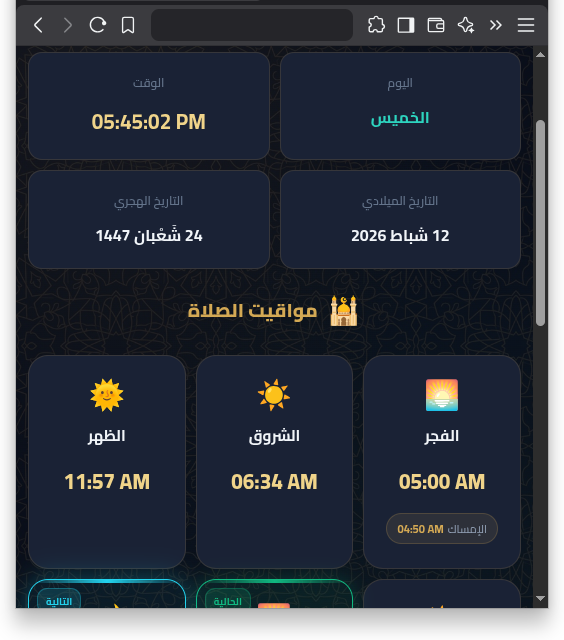

<div align="center">

# 🕌 لوحة بيانات المسجد
### Mosque Dashboard

لوحة بيانات تفاعلية لعرض مواقيت الصلاة، التاريخ الهجري والميلادي، الطقس، والمزيد.
مصمَّمة للعرض على شاشات المساجد أو كصفحة شخصية على GitHub Pages.

**لا تحتاج خادم • لا تحتاج قاعدة بيانات • HTML/CSS/JS فقط**

---




</div>

---

## ✨ المميزات

| الميزة | الوصف |
|--------|-------|
| 🕐 **الساعة الحية** | عرض الوقت الحالي بنظام 12 أو 24 ساعة |
| 📅 **التاريخ الميلادي** | دعم 6 أنماط لأسماء الأشهر (شامي، مصري، مغاربي، عراقي، إنجليزي، فرنسي) |
| 🌙 **التاريخ الهجري** | يُجلب من Aladhan API مع احتياط من المتصفح |
| 🕌 **مواقيت الصلاة** | الفجر، الشروق، الظهر، العصر، المغرب، العشاء + الإمساك |
| ⏱️ **العد التنازلي** | عداد حي مع وميض أحمر تنبيهي عند بقاء دقيقة واحدة |
| 🔊 **صوت الأذان** | قائمة ملفات عشوائية منفصلة للفجر وباقي الصلوات — تتجاهل الملفات المفقودة تلقائياً |
| 🌤️ **حالة الطقس** | درجة الحرارة ووصف الحالة بالعربية (Open-Meteo API) |
| 🎨 **خلفية إسلامية** | زخرفة أندلسية بشفافية قابلة للتعديل |
| 🔄 **إعادة اتصال تلقائية** | عند فشل أي API، يُعاد كل 30 ثانية حتى النجاح |
| 📱 **تصميم متجاوب** | يعمل على جميع أحجام الشاشات |
| 🔄 **زر التحديث** | في أسفل الصفحة لإعادة تحميل كل شيء |

---

## 📁 هيكل المشروع

```
masjed/
├── index.html          ← الصفحة الرئيسية
├── style.css           ← الأنماط (Islamic Dark Theme)
├── script.js           ← المنطق البرمجي (IIFE معزول)
├── config.js           ← ⚙️ ملف الإعدادات (عدّل هذا فقط)
├── bg-pattern.png      ← الخلفية الزخرفية
├── adhan1.mp3          ← ملفات أذان (تضيفها بنفسك)
├── fajr-adhan1.mp3     ← ملفات أذان الفجر (تضيفها بنفسك)
├── Screenshot1.png     ← لقطة شاشة
├── Screenshot2.png     ← لقطة شاشة
└── README.md           ← هذا الملف
```

---

## 🚀 البدء السريع

### 1. استنساخ المشروع

```bash
git clone https://github.com/yucefsourani/free-masjid-dashboard.git
cd free-masjid-dashboard
```

### 2. تعديل الإعدادات

افتح **`config.js`** وعدّل حسب مسجدك:

```javascript
var MOSQUE_CONFIG = {

    mosqueName: "اسم مسجدك",
    mosqueIcon: "masjidlogo.png",       // اختياري

    latitude: 33.8938,                    // خط العرض
    longitude: 35.5018,                   // خط الطول
    timezone: "Asia/Beirut",              // المنطقة الزمنية

    monthNamingStyle: "levant",           // نمط أسماء الأشهر
    timeFormat: "12h",                    // "12h" أو "24h"
    calculationMethod: 5,                 // طريقة الحساب

    adjustments: {                        // تعديلات بالدقائق
        Fajr: 0, Sunrise: 0, Dhuhr: 4,
        Asr: 0, Maghrib: 3, Isha: 1
    },
    imsakAdjustment: -10,                 // قبل الفجر بـ 10 دقائق

    backgroundOpacity: 0.10,              // شفافية الخلفية

    // قوائم ملفات الأذان (يُختار عشوائياً)
    adhanSounds: ["adhan1.mp3", "adhan2.mp3"],
    fajrAdhanSounds: ["fajr-adhan1.mp3"],

    dailyMessage: "حديث أو آية"
};
```

### 3. تشغيل محلي

افتح `index.html` في المتصفح — **لا حاجة لخادم**.

### 4. نشر على GitHub Pages

1. ارفع المشروع على GitHub
2. **Settings → Pages → Source: Deploy from branch → `main` / `/`**
3. اضغط **Save** — الرابط يظهر خلال دقائق

---

## ⚙️ دليل الإعدادات

### إحداثيات الموقع

افتح [Google Maps](https://maps.google.com) → انقر يمين على المسجد → انسخ الإحداثيات.

### المنطقة الزمنية (`timezone`)

| البلد | القيمة |
|-------|--------|
| 🇱🇧 لبنان | `Asia/Beirut` |
| 🇸🇦 السعودية | `Asia/Riyadh` |
| 🇪🇬 مصر | `Africa/Cairo` |
| 🇩🇿 الجزائر | `Africa/Algiers` |
| 🇲🇦 المغرب | `Africa/Casablanca` |
| 🇹🇷 تركيا | `Europe/Istanbul` |
| 🇯🇴 الأردن | `Asia/Amman` |
| 🇮🇶 العراق | `Asia/Baghdad` |
| 🇹🇳 تونس | `Africa/Tunis` |
| 🇱🇾 ليبيا | `Africa/Tripoli` |
| 🇸🇾 سوريا | `Asia/Damascus` |
| 🇵🇸 فلسطين | `Asia/Hebron` |
| 🇰🇼 الكويت | `Asia/Kuwait` |
| 🇶🇦 قطر | `Asia/Qatar` |

> ⚠️ استخدم اسم المنطقة (مثلاً `Asia/Beirut`) وليس الإزاحة (`UTC+2`) لتدعم التوقيت الشتوي/الصيفي تلقائياً.

### طرق حساب المواقيت (`calculationMethod`)

| الرقم | الطريقة | المنطقة |
|-------|---------|---------|
| 3 | رابطة العالم الإسلامي | عالمي |
| 4 | أم القرى | السعودية |
| **5** | **الهيئة المصرية** | **مصر، لبنان، الشام** |
| 8 | منطقة الخليج | الخليج |
| 13 | تركيا | تركيا |
| 18 | تونس | تونس |
| 19 | الجزائر | الجزائر |
| 21 | المغرب | المغرب |

### أنماط أسماء الأشهر (`monthNamingStyle`)

| القيمة | المنطقة | مثال |
|--------|---------|------|
| `levant` | لبنان، سوريا، فلسطين، الأردن | شباط، حزيران |
| `egyptian` | مصر والخليج | فبراير، يونيو |
| `maghreb` | الجزائر، تونس، المغرب | فيفري، جوان |
| `iraqi` | العراق | شباط، حزيران |
| `english` | إنجليزي | February, June |
| `french` | فرنسي | Février, Juin |

### تعديلات المواقيت (`adjustments`)

بالدقائق: **موجب = تأخير**، **سالب = تقديم**

### إعدادات الأذان (`adhanSounds`, `fajrAdhanSounds`)

كل إعداد عبارة عن **قائمة** (مصفوفة) من أسماء الملفات الصوتية:

| الإعداد | يُستخدم لـ | عند تركه فارغاً `[]` |
|---------|-----------|---------------------|
| `adhanSounds` | الظهر، العصر، المغرب، العشاء | لا صوت لهذه الصلوات |
| `fajrAdhanSounds` | الفجر فقط | لا صوت للفجر |

**السلوك:**
- يُختار ملف **عشوائياً** من القائمة عند كل أذان
- إذا الملف المختار **غير موجود** → ينتقل بصمت للملف التالي
- إذا **كل الملفات** غير موجودة أو القائمة فارغة → **لا صوت بدون أي خطأ**

**أمثلة:**

```javascript
// عدة ملفات أذان (يُختار عشوائياً)
adhanSounds: ["adhan1.mp3", "adhan2.mp3", "adhan3.mp3"],
fajrAdhanSounds: ["fajr1.mp3", "fajr2.mp3"],

// ملف واحد فقط
adhanSounds: ["adhan.mp3"],
fajrAdhanSounds: ["fajr.mp3"],

// تعطيل الصوت بالكامل
adhanSounds: [],
fajrAdhanSounds: [],
```

> ⚠️ المتصفحات تمنع الصوت التلقائي حتى ينقر المستخدم على الصفحة مرة واحدة.

### شفافية الخلفية (`backgroundOpacity`)

`0.0` مخفية — `0.05`-`0.10` هادئة (موصى بها) — `0.15`-`0.25` واضحة — `1.0` كاملة

---

## 🔄 التحديث التلقائي

| الحدث | التكرار |
|-------|---------|
| الساعة والعد التنازلي | كل ثانية |
| بيانات الطقس | كل 30 دقيقة |
| مواقيت الصلاة | عند منتصف الليل |
| إعادة محاولة عند فشل API | كل 30 ثانية |

---


## 🌐 APIs المستخدمة

| API | الغرض | التكلفة |
|-----|--------|---------|
| [Aladhan](https://aladhan.com/prayer-times-api) | مواقيت الصلاة + الهجري | مجاني |
| [Open-Meteo](https://open-meteo.com/) | الطقس | مجاني |
| [Google Fonts](https://fonts.google.com/) | خطوط Cairo و Amiri | مجاني |

---

## 🛠️ استكشاف الأخطاء

| المشكلة | الحل |
|---------|------|
| المواقيت خاطئة بساعة | استخدم اسم IANA (`Asia/Beirut` وليس `UTC+2`) |
| الصفحة فارغة | F12 → وحدة التحكم → تحقق من الأخطاء |
| فشل جلب المواقيت/الطقس | إعادة اتصال تلقائية كل 30 ثانية |
| الصوت لا يعمل | انقر الصفحة مرة + تأكد من أسماء الملفات |
| الخلفية لا تظهر | تأكد من `bg-pattern.png` و `backgroundOpacity > 0` |

---


---

## 💡 نصائح للاستخدام في المسجد

1. **ملء الشاشة**: F11 في المتصفح
2. **منع إطفاء الشاشة**: إضافة "Keep Awake" أو إعدادات النظام
3. **تفعيل الصوت**: نقرة واحدة على الصفحة بعد التحميل
4. **مشكلة؟**: زر "تحديث" في أسفل الصفحة

---

## 📜 الترخيص

مشروع مفتوح المصدر — استخدمه بحرية لأي مسجد أو مؤسسة إسلامية.

---

<div align="center">

**أعوذ بالله من الشيطان الرجيم**

*«إِنَّمَا يَعْمُرُ مَسَاجِدَ اللَّهِ مَنْ آمَنَ بِاللَّهِ وَالْيَوْمِ الْآخِرِ وَأَقَامَ الصَّلَاةَ وَآتَى الزَّكَاةَ وَلَمْ يَخْشَ إِلَّا اللَّهَ ۖ فَعَسَىٰ أُولَٰئِكَ أَن يَكُونُوا مِنَ الْمُهْتَدِينَ »*

سورة التوبة — آية 18

</div>
